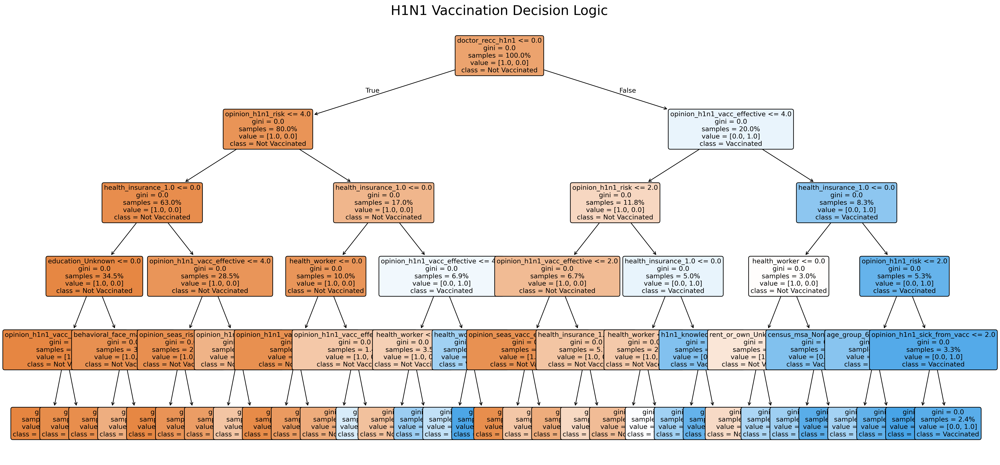

# Targeting Trust: Predicting H1N1 Vaccination Drivers

**By Abel Aleu Chol Garang | Data Scientist**

## Introduction
This project aims to predict whether individuals received the H1N1 flu vaccine based on demographic and behavioral data from the **National 2009 H1N1 Flu Survey (NHFS)**. By identifying key behavioral, demographic, and attitudinal drivers, this analysis provides actionable insights for public health preparedness and more effective vaccination campaigns.

## Vaccination Decision Logic
The decision tree below illustrates the primary logic our classification framework uses to predict vaccination status. It highlights how specific features like doctor recommendations and personal risk perception drive the final outcome.

## Key Findings
* **Doctor Recommendation:** Having a doctor recommend the vaccine was the strongest predictor of uptake across all models.
* **Risk Perception:** Individuals who perceived a higher personal risk of contracting H1N1 were significantly more likely to be vaccinated.
* **Knowledge & Opinions:** A high perception of vaccine effectiveness and general H1N1 knowledge correlated strongly with successful vaccination.

## Project Overview
This project develops a **binary classification framework** to predict H1N1 vaccine uptake. 

Using data from the **National 2009 H1N1 Flu Survey (NHFS)**, the analysis focuses on:
* **Feature Engineering:** Identifying the most influential drivers of trust and action.
* **Model Selection:** Utilizing machine learning to provide a predictive map of vaccine recipients.
* **Public Health Impact:** Offering a data-driven approach to help health departments target their outreach efforts where they will be most effective.

> **Note:** If GitHub `fails` to render the notebook below, please use the link below to view the full 86-cell analysis: 
### Use this link inscase the gitHub fails to render the notebook

[View Notebook on NBViewer (Recommended)](https://nbviewer.org/github/abelchol-ship-it/H1N1_2009_Vaccine_Predictive_Project_Abel_Aleu_Chol/blob/main/phase3_h1n1_vaccine_prediction_Abel_Aleu_Chol.ipynb)

## Tableau Dashboard
**Interactive Visual Insights**  
Explore the deep-dive Exploratory Data Analysis (EDA) and psychological drivers of vaccine hesitancy in the interactive dashboard.  

 **View the Tableau Dashboard Here:** (https://public.tableau.com/views/National2009H1N1FluVaccineSurvey/VaccineFlueSurvey?:language=en-US&:sid=&:redirect=auth&:display_count=n&:origin=viz_share_link)

## Key Objectives
- **Predictive Modeling:** Build a classifier to distinguish vaccinated vs. non-vaccinated individuals.  
- **Feature Importance:** Rank the strongest predictors—from doctor recommendations to perceived vaccine efficacy.  
- **Strategic Insights:** Deliver a data-driven profile of vaccine-hesitant groups to improve outreach efficiency.  
- **Optimization:** Balance Precision and Recall to minimize missed immunization opportunities (False Negatives).  

## Tech Stack & Workflow
- **Data Handling:** Pandas, NumPy  
- **Visualization:** Matplotlib, Seaborn, Tableau  
- **Machine Learning:** Scikit-Learn (Logistic Regression, Decision Trees, Random Forest)  

**Process:**  
1. **Data Preparation:** Handled missing values via imputation and categorical encoding.  
2. **Modeling:** Compared baseline models against tuned classifiers using GridSearchCV.  
3. **Evaluation:** Prioritized ROC-AUC (> 0.80) and Recall (≥ 70%) for the vaccinated class.  

## Major Findings
- **The "Doctor Factor":** Physician recommendations were among the strongest predictors of vaccine uptake.  
- **Perception Matters:** Individual beliefs regarding vaccine effectiveness and personal risk (the "Fear Paradox") outweighed many demographic factors.  
- **Feature Drivers:** Top 15 features were dominated by psychological perceptions and clinical safety concerns rather than just socioeconomic status.  

## Repository Structure
* `Images/`: Visualizations, including the Decision Tree and ROC curves.
* `PPTX_CSV_Files/`: Technical presentations and supporting data files.
* `H1N1_vaccine_prediction_Presentation_Abel_Aleu_Chol.pdf`: PDF showing not technical presentation.
* `phase3_h1n1_vaccine_prediction_Abel_Aleu_Chol.ipynb`: The primary Jupyter Notebook containing all cleaning, modeling, and evaluation.

## Ethical Note
This analysis complies with the **Public Health Service Act** and utilizes **anonymized data** from the National Center for Health Statistics (NCHS).  